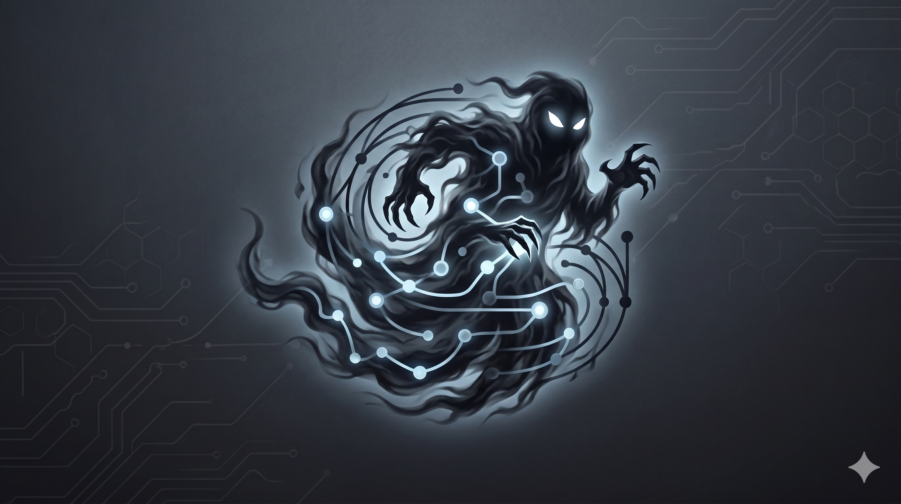

# GhostGUI

A lightweight graphical interface for editing reference-frame and robot-state
trajectories against registered MuJoCo robot models. Unitree G1, Go2, H2, and
Z1 are included.

## Installation

Linux/Ubuntu is the primary tested platform. macOS and Windows install scripts
are provided for convenience, but should be treated as experimental until they
are verified on those platforms.

The Python dependencies are declared in `pyproject.toml`. The platform install
scripts create or reuse `.venv`, upgrade the packaging tools, and install this
checkout in editable mode so the bundled model assets remain available from the
cloned repository.

### Linux / Ubuntu

```bash
git clone <your-ghostgui-repository-url> ghostgui
cd ghostgui
bash scripts/install_linux.sh
bash scripts/run_linux.sh
```

### macOS

```bash
git clone <your-ghostgui-repository-url> ghostgui
cd ghostgui
bash scripts/install_macos.sh
bash scripts/run_macos.sh
```

The macOS install script supports both native Mac architectures: `arm64` for
Apple Silicon and `x86_64` for Intel Macs. It verifies that Python, `.venv`, and
`mjpython` match the Mac's native architecture; on Apple Silicon it prefers the
Homebrew Python at `/opt/homebrew/bin/python3`.

### Windows PowerShell

```powershell
git clone <your-ghostgui-repository-url> ghostgui
cd ghostgui
powershell -ExecutionPolicy Bypass -File scripts/install_windows.ps1
powershell -ExecutionPolicy Bypass -File scripts/run_windows.ps1
```

After installation, the app can also be launched from the activated virtual
environment with:

```bash
ghostgui
```

Choose the model from the **Robot model** control, or start directly with Go2:

```bash
ghostgui --model go2
```

The legacy direct launcher is still available for development checkouts:

```bash
python3 scripts/run_gui.py --model go2
```

See `docs/install.md` for additional troubleshooting notes.
See `docs/user_guide.md` for the workflow guide, control map, export notes, and
the Preview-vs-Slice explanation. The same guide is available from the in-app
`?` help button.

G1 loads its MJCF and original STL visual meshes directly. Go2, H2, and Z1 load
from URDF registrations with their bundled visual assets. Go2 resolves the
vendored `package://go2_description/dae/...` assets and converts the DAE
material parts to MuJoCo-compatible OBJ files once in the versioned model cache.
The runtime model retains its joints, limits, collision shapes, semantic
targets, lighting, visual meshes, colors, and kinematic tree. Missing or
unsupported visual assets fail with an explicit path/format message instead of
silently displaying collision primitives.

Model files are loaded off the GUI thread when switching, importing, or adding
a scene actor. Actors that use the same model path share one immutable MuJoCo
model while retaining independent pose, timeline, and IK state. Each loaded
actor keeps its own in-memory editor session, so switching back is immediate,
but every session is rebound to one shared scene canvas instead of allocating a
new OpenGL widget/context. Mesh chunks are uploaded as shared indexed GPU
vertex/index buffers under a small per-tick time budget, while simple MuJoCo
primitives keep their compact display lists. The 3D display panel can render
secondary robots as full visuals, proxy boxes, or kinematic skeletons; editing
a robot always restores its full visual model. Context-owned buffers and lists
are explicitly released when the shared canvas closes.

User-imported URDF models are converted once into a versioned, content-addressed
cache under `~/.cache/ghostgui/models/` (override with
`GHOSTGUI_CACHE_DIR`). Changing the URDF, a resolved mesh, MuJoCo version, or
GhostGUI cache format creates a fresh cache entry automatically.

The live **3D View** tab loads the selected registry model, exposes its controllable
joint sliders, supports free TCP translation from the central sphere, X/Y/Z
arrow translation, and X/Y/Z ring rotation with MuJoCo Jacobian IK, and can
generate/play a simple qpos trajectory with
transparent ghosts. Drag IK is solved in a temporary state and accepted only
when MuJoCo reports no self/environment collision; the collision-substep control
sets how finely motion is clamped at a contact boundary.

Trajectory keyframes expose target roll, pitch, and yaw in radians. Orientation
is stored with each logical-frame keyframe, interpolated with quaternion SLERP,
and solved with MuJoCo position and rotation Jacobians during **Generate /
Simulate Trajectory**. Accepting a 3D ring-rotation preview copies the solved
frame orientation back into the corresponding trajectory keyframe. The exported
robot trajectory stores the floating-base orientation as `base_qw`, `base_qx`,
`base_qy`, and `base_qz`; limb orientation is represented by the solved joints.

3D edits use a MoveIt-style preview workflow. The model-colored robot is the
committed timeline state and remains fixed while dragging. A semi-transparent
orange robot follows collision-aware IK and joint-slider edits. **Plan Preview**
shows a committed-to-preview ghost path without saving it, **Accept Preview**
writes the orange pose into only the current timeline keyframe, and **Cancel
Preview** discards it. Changing timeline time also discards an unaccepted
preview. Joint sliders edit the preview rather than silently changing committed
qpos. **Alpha** adjusts only the orange preview (`0.1–1.0`); the OpenGL scene
and Qt window remain opaque.

Double-click a rendered robot body to select its nearest logical trajectory
frame. G1 hands, wrists, feet, ankles, pelvis, and torso map to their configured
frames; Go2 base and leg bodies map to `base` or the corresponding
`FL/FR/RL/RR_foot`. Picking uses the closest MuJoCo geom bounding sphere, so very
small or overlapping decorative geometry may resolve to its nearest editable
parent/child frame.

The **Reset 3D Pose** button is a one-shot action: it pauses playback, cancels an
active gizmo drag, and restores model home qpos at the currently selected GUI
time only. It does not replace or repeatedly modify the playback list. Changing
`Time [s]` loads or creates an independent 3D
qpos keyframe, so edits at `0.2s` do not modify `0s`. Selecting G1 `pelvis` or
Go2 `base` drives the model's floating root joint and is still checked for collisions.
The existing 2D editors and separate **3D MuJoCo** CSV player remain available.

To edit a saved single-pose qpos file, open the live **3D View** tab and click
**Load qpos CSV**. The file must contain one headerless row with exactly the
active model's `nq` values (36 for G1), such as `csv/crawl_home_qpos_t0.5.csv`.
Move the robot with the transform gizmo or joint sliders, click **Accept
Preview**, then click **Save qpos CSV** and choose a new filename. Saving writes
the committed pose as another headerless qpos row; an unaccepted orange preview
is deliberately not saved.

Open a saved G1 pose directly in the standalone MuJoCo viewer with:

```bash
python3 scripts/view_g1_mujoco.py --csv csv/updated_qpos.csv --model models/g1_29dof.xml
```

The player accepts both these headerless qpos pose files and the existing
headered trajectory CSV format.

The 3D sidebar's **IK controls** tab provides weighted damped-least-squares
settings, independent per-joint influence sliders, and model-aware presets.
Influence `0` locks a joint for limb IK, `1` is normal, and values above `1`
prefer that joint. The task controls combine TCP position/orientation, posture
preservation, planted feet, root/base orientation, and home-pose regularization
in the orange preview state. Posture and regularization are opt-in so the
default TCP drag retains the model's full kinematic range. Task priority levels
are recorded (`locks=1`,
`TCP=2`, `posture/regularization=3`), but this version intentionally uses one
weighted task stack rather than claiming strict null-space hierarchy.

Right-drag rotates the live 3D camera and the mouse wheel zooms. Gizmo axes are
world-aligned; a local-frame mode is a future extension.

The **Frames**, **Status**, and in-tab **3D** control sidebars have compact
chevron handles and remember their expanded widths. `Ctrl+[` toggles Frames and
`Ctrl+]` toggles Status. **Use model colors** is enabled by default: the live
renderer resolves MuJoCo material assignments, giving this model its original
black/silver appearance. Its robot materials do not reference texture assets;
textured visual materials in other models currently fall back to material RGBA.

## Project Structure

```
ghostgui/
├── README.md
├── application/
├── backend/
├── core/
├── csv/
├── docs/
├── gui/
├── models/
├── pyproject.toml
├── scripts/
└── tests/
```

Run the model/state sanity checks with:

```bash
python3 -m unittest discover -s tests -v
```

## Manual model checks

- G1: run `python3 scripts/run_gui.py --model g1`; confirm 29 joint sliders, the
  humanoid kinematic skeleton, logical hand/foot targets, gizmo dragging,
  orange preview, Plan/Accept/Cancel, double-click selection, reset, timeline
  states, and ghosts.
- Go2: run `python3 scripts/run_gui.py --model go2`; confirm 12 joint sliders, the
  base/four-leg skeleton, `FL/FR/RL/RR_foot` targets, lit ground, and detailed
  colored mesh geometry rather than boxes/capsules.
- H2/Z1: run `python3 scripts/run_gui.py --model h2` or `--model z1`; confirm the
  robot selector shows `Unitree H2` / `Unitree Z1`, logical targets populate,
  and the bundled visual meshes render.
- Preview: drag a hand or foot and vary **Alpha**; confirm only the orange robot
  becomes transparent and the dark 3D background never exposes the desktop.
- Path independence: from another directory run
  `python3 /path/to/ghostgui/scripts/run_gui.py --model go2`. Registry paths are
  anchored to the source tree, not the shell working directory.
